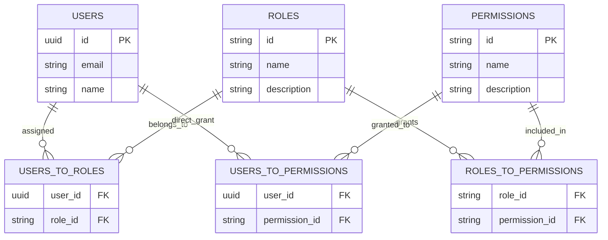

# RBAC (roles and permissions)

Veap provides a role-based access control (RBAC) engine that evaluates roles and permissions for both UI presentation and backend mutations. Checks require "at least one role" and "all permissions".

## Data model

The RBAC data layer is fully relational and supports both role-based inheritance and direct user permission overrides:



Tables created by core migrations:

- `roles` (id, name, description)
- `permissions` (id, name, description)
- `roles_to_permissions` (role_id, permission_id)
- `users_to_roles` (user_id, role_id)
- `users_to_permissions` (user_id, permission_id)

Permission names are free-form strings; the convention used across Veap plugins is `resource:action` (for example `post:create`, `settings:read`).

## Managing roles and permissions

All functions are server-side facades from `@veap/framework/auth/server`:

```ts
import {
  createRole,
  createPermission,
  getRoles,
  getPermissions,
  assignPermissionToRole,
  revokePermissionFromRole,
  assignRoleToUser,
  revokeRoleFromUser,
  assignPermissionToUser,
  revokePermissionFromUser,
  getUserRbacData,
} from "@veap/framework/auth/server";

await createRole("editor", "Can edit content");
await createPermission("post:create", "Allow creating posts");
await assignPermissionToRole(editorRole.id, perm.id);
await assignRoleToUser(user.id, editorRole.id);
```

`getUserRbacData(userId)` returns the user's roles and permissions in one call; it is also what feeds the core RBAC augmenter on every session validation.

## Checking in routes

Declarative, collected along the layout chain:

```tsx
// page.tsx or layout.tsx
export const auth = true;
export const roles = ["admin", "editor"]; // at least one
export const permissions = ["post:create"]; // all required
```

The virtual router turns these into `EnsuredAuth`; failures redirect (pages) or return 401 JSON (API). See [Middleware](../routing/middleware.md).

## Checking in code

```ts
import { getCurrentSession, checkSecurity } from "@veap/framework/auth/server";

const { session, user } = await getCurrentSession();
const result = await checkSecurity(session, user, ["admin"], ["settings:read"]);
if (!result.satisfied) {
  // result.redirect tells you where the router would send the user
}
```

Semantics of `checkSecurity`:

- Missing user: not satisfied.
- Roles: satisfied if the user has **at least one** of the required roles.
- Permissions: satisfied if the user has **all** required permissions.
- Registered security requirements (2FA, email verification) run afterwards and can still veto.

## Declaring plugin permissions on `onEnable`

When a plugin introduces domain features (such as blog posts or products), it should register its permissions idempotently in its `onEnable` lifecycle hook and assign them to the administrator role:

```ts
// plugins/blog-plugin/src/index.ts
import {
  createPermission,
  getPermissions,
  getRoles,
  assignPermissionToRole,
} from "@veap/framework/auth/server";
import type { IPlugin } from "@veap/framework/plugins";

const blogPlugin: IPlugin = {
  // ...
  onEnable: async () => {
    const requiredPermissions = [
      { name: "posts:read", description: "View blog articles" },
      { name: "posts:create", description: "Create new blog articles" },
      { name: "posts:edit", description: "Edit existing blog articles" },
      { name: "posts:delete", description: "Delete blog articles" },
    ];

    const existingPermissions = await getPermissions();
    const existingRoles = await getRoles();
    const adminRole = existingRoles.find((r) => r.name === "admin");

    for (const permDef of requiredPermissions) {
      let permission = existingPermissions.find((p) => p.name === permDef.name);

      // Create permission if it doesn't exist yet
      if (!permission) {
        permission = await createPermission(permDef.name, permDef.description);
      }

      // Automatically grant to admin role
      if (adminRole && permission) {
        await assignPermissionToRole(adminRole.id, permission.id);
      }
    }
  },
};

export default blogPlugin;
```

## Protecting Server Actions with RBAC

Server Actions execute on the server and must independently verify user authentication and permissions before performing database mutations:

```ts
"use server";

import { getCurrentSession, checkSecurity } from "@veap/framework/auth/server";
import { AppError } from "@veap/framework";
import { transaction } from "@veap/framework/database";
import { Post } from "../models/post";

export async function deletePostAction(postId: string) {
  // 1. Resolve current session
  const { session, user } = await getCurrentSession();

  if (!user || !session) {
    throw AppError.Unauthorized("You must be logged in to delete posts.");
  }

  // 2. Authorize permissions
  const security = await checkSecurity(session, user, undefined, [
    "posts:delete",
  ]);
  if (!security.satisfied) {
    throw AppError.Forbidden("You lack the 'posts:delete' permission.");
  }

  // 3. Perform mutation within an atomic transaction
  return await transaction(async () => {
    const post = await Post.findOrFail(postId);
    await post.delete();
    return { success: true };
  });
}
```

## Protecting API routes and custom `ApiMiddleware`

Virtual router API routes (`api/[...catchAll]/route.ts`) support an array of `middlewares` executing before the route handler:

```ts
// plugins/blog-plugin/src/app/api/posts/route.ts
import {
  ApiEnsuredAuth,
  type ApiMiddleware,
} from "@veap/framework/router/server";

// Custom API middleware to enforce API tokens or custom permissions
const requirePostScope: ApiMiddleware = async (request, context, next) => {
  const apiKey = request.headers.get("x-api-key");

  // Optional: check API Key or Bearer token
  if (apiKey && apiKey === process.env.SERVICE_API_KEY) {
    return await next();
  }

  // Fallback to session check
  const permissions = context.permissions || [];
  if (!permissions.includes("posts:read")) {
    return new Response(
      JSON.stringify({ error: "Forbidden: missing posts:read" }),
      {
        status: 403,
        headers: { "Content-Type": "application/json" },
      },
    );
  }

  return await next();
};

export const middlewares = [ApiEnsuredAuth, requirePostScope];

export async function GET(request: Request) {
  const posts = await Post.query().limit(20).get();
  return Response.json(posts);
}
```

## Navigation filtering

Navigation items and extension points accept `roles`/`permissions` and are filtered per user before rendering:

```ts
// in a plugin's navigation definition
navigation: {
  admin: {
    Content: {
      title: "Content",
      priority: 10,
      items: [
        { title: "Posts", url: "/posts", icon: "file-text", permissions: ["posts:create"] },
      ],
    },
  },
}
```

The same filter shape applies to plugin `widgets` and `extensions`. This hides UI, but always pair it with route-level checks; filtering is presentation, not enforcement.

## RBAC and the first user

The installer flow creates the first user as `admin`. The panel plugin ships the UI for managing roles, permissions and user assignments under the admin area.
