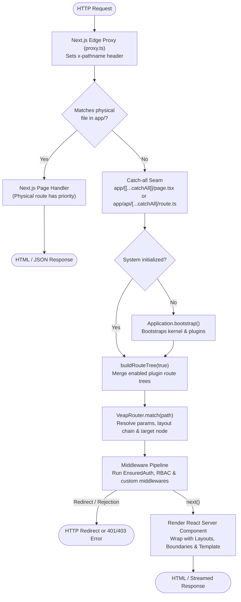
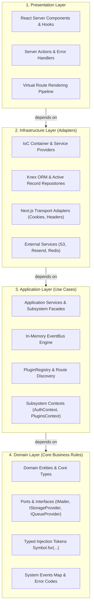
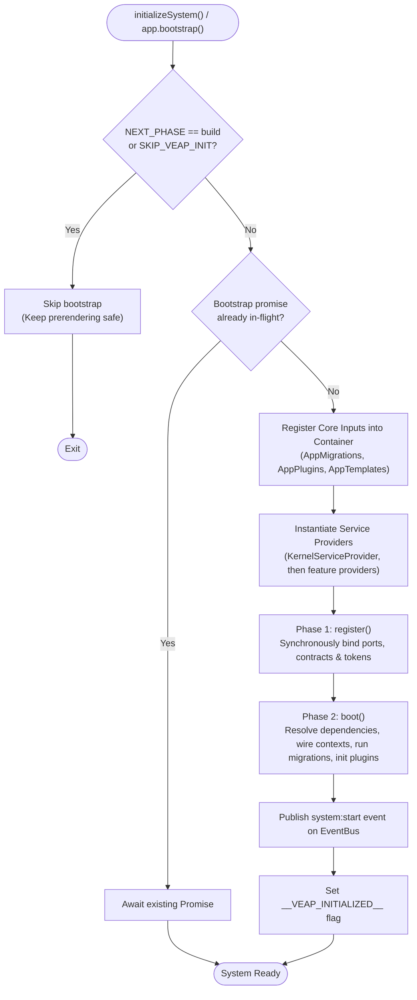
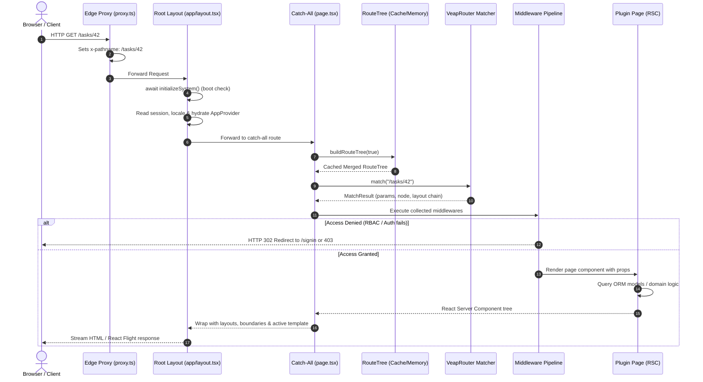

# Architecture

Veap runs inside a Next.js App Router application. Next.js keeps doing what it does: static files, its own `app/` routes, React Server Components, Server Actions. Veap adds an application layer on top, in the request path and at boot time.

## The big picture

The following diagram illustrates how an incoming HTTP request flows from the Next.js boundary through the Veap virtual routing engine and down to your plugin components:



Two catch-all routes are the seam between Next.js and Veap:

- `app/[[...catchAll]]/page.tsx` forwards page URLs to `VeapRouter`.
- `app/api/[...catchAll]/route.ts` forwards `/api/*` URLs to plugin API route handlers.

URLs that a physical Next.js page handles never reach the catch-all. Next.js has priority; Veap handles the rest.

## Clean Architecture layering

The `@veap/framework` codebase follows a strict Clean Architecture layout (documented in framework decision record [ADR-006](../advanced/custom-providers.md)). Dependencies point exclusively **inward**, ensuring that domain rules remain completely agnostic of HTTP transports, database engines, and UI frameworks:



The dependency rule: everything points inward. Application services depend on domain ports (`ICookieStore`, `IMailer`, `IPasswordHasher`, repositories), and the infrastructure layer binds concrete adapters (Next.js cookies, Nodemailer, bcrypt, ActiveRecord repositories) to those ports at boot. This is why services are unit-testable without Next.js, and why transports and hashers are swappable.

## Boot lifecycle

`Application` (in `lib/veap.ts`) is built with a fluent builder and bootstrapped once per server process:

```ts
export const app = Application.configure()
  .withDatabase()
  .withAuth()
  // ...
  .create();

export const initializeSystem = cache(async () => {
  return app.bootstrap();
});
```

The following flowchart shows the sequential stages of the boot pipeline:



`bootstrap()` executes the following steps in order:

1. **Skips** when running during `next build` (`NEXT_PHASE=phase-production-build`) or when `SKIP_VEAP_INIT=true`. This is deliberate; prerendering must not boot providers.
2. **Deduplicates** across concurrent requests: a second caller awaits the in-flight bootstrap promise; after success a global flag short-circuits further calls.
3. Registers the builder's inputs (`AppMigrations`, `AppPlugins`, `AppTemplates`) into the container.
4. Instantiates providers in registration order: `KernelServiceProvider` first, then the ones added by `with*` calls.
5. Calls `register()` on every provider (bind contracts and services into the IoC container; do not resolve anything here).
6. Calls `boot()` on every provider (safe to resolve; wires contexts, runs core and app migrations, initializes plugins, registers CLI commands).
7. Publishes the `system:start` event.

Bootstrap errors are logged, not thrown (except Next.js redirect signals), so a failed boot does not crash the Next.js server process; subsystems that depend on the failed part will fail with "Context is not bound" style errors, which is your signal to check the boot log.

## The kernel and service providers

`KernelServiceProvider` always runs first. It binds the framework primitives into the container:

- `EVENT_BUS` (the global `eventBus` singleton) and the `EventBus` class alias
- `LOGGER` (console logger) and `LoggerService`
- `CONFIG_SERVICE` (zod-validated environment) and `VEAP_CONFIG` (`veap.config.ts` loader)
- `CACHE_PROVIDER` (in-memory cache)
- `COOKIE_STORE` and `REQUEST_CONTEXT` (Next.js adapters for cookies/headers/redirect)

Feature providers register their own bindings. For example `AuthServiceProvider` binds `PASSWORD_HASHER` to a bcrypt adapter, `TOKEN_GENERATOR` to an Oslo adapter, repository ports to ActiveRecord implementations, and the six auth application services; then in `boot()` it binds the `AuthContext` object that the auth facades read from.

`ServiceProvider` is the extension point: `register()` binds, `boot()` wires. See [Service providers](./service-providers.md) for writing your own.

## The context pattern

Application facades never call `app()` themselves. Each subsystem has a context object that its provider binds once at boot:

```ts
// src/application/auth/context.ts (shape)
interface AuthContext {
  user: UserService;
  session: SessionService;
  rbac: RbacService;
  passwordReset: PasswordResetService;
  emailVerification: EmailVerificationService;
  auth: AuthService;
}
```

`getCurrentSession()` and friends read `authContext()`. If the provider has not booted, the context getter throws `"[Auth] Context is not bound ..."`. The same pattern exists for plugins and communication. For application code this is an implementation detail; for framework code it is the rule that keeps container lookups out of request code.

## Request lifecycle

The following sequence diagram details how an incoming page request is resolved, protected, and rendered:



For a page request to `/tasks/42`:

1. `app/layout.tsx` awaits `initializeSystem()`, reads the session, resolves the path prefix and renders `I18nProvider` + `AppProvider` with plugin extension points around `children`.
2. The optional catch-all awaits `initializeSystem()`, then `buildRouteTree(true)` merges every enabled plugin's route tree (with the admin prefix resolved) into one `RouteTree`. The merged tree is cached in the cache provider in production and invalidated by plugin toggle events.
3. `VeapRouter` matches `/tasks/42` against the tree, producing a `MatchResult` with params, a layout chain and the matched node.
4. Middlewares are collected from the layout chain (outermost first), plus route-level exports; `EnsuredAuth` is prepended if any level declares `auth`, `roles` or `permissions`.
5. The pipeline runs: each middleware can inspect `VeapMiddlewareContext`, redirect, or call `next()`. The final callback builds the React tree: page wrapped by layouts from innermost to outermost, each level optionally wrapped in its `error` boundary and `loading` Suspense, with parallel slots resolved per layout.
6. If the URL is outside the private prefix and a template is active, the template layout wraps the content.
7. Metadata: the catch-all's `generateMetadata` calls `tree.generateMetadata(path)`, which merges `generateMetadata` exports along the matched path.

For `/api/*` requests the API catch-all performs the same match and instead invokes the route handler export (`GET`, `POST`, ...) with the enriched context, wrapped in the API middleware pipeline (`ApiEnsuredAuth` returns 401 JSON instead of redirecting).

## Where the state lives

- **Process-global singletons** (`container`, `eventBus`, logger, contexts) live on `globalThis` to survive HMR and dual-package boundaries. They are per-server-process, not per-request.
- **Request-scoped values** (active transaction) live in `AsyncLocalStorage`.
- **Per-request caching** uses React `cache` (`getCurrentSession`, `buildRouteTree`, `getActiveTemplate`).
- **Persistent state** lives in the database (users, sessions, plugin status, settings) and the filesystem (storage provider).
