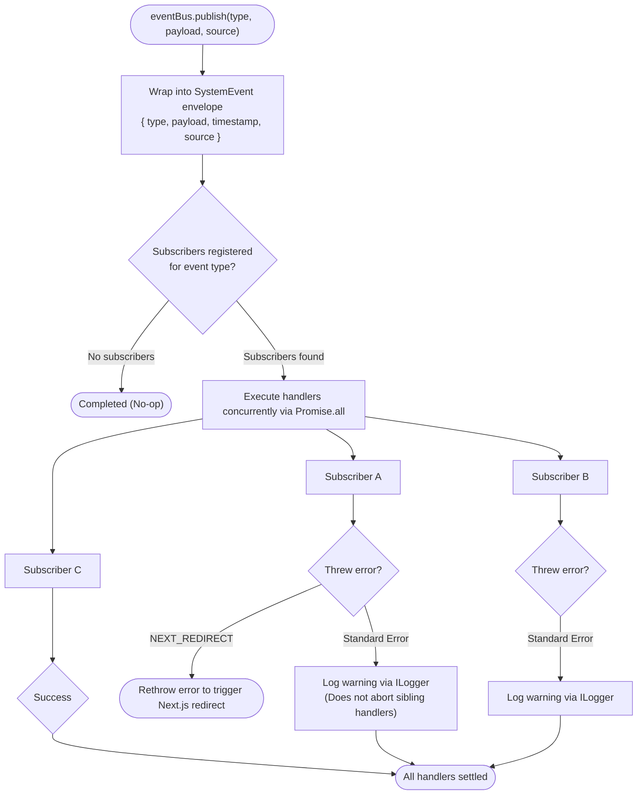

# Event bus

Veap provides an in-process publish/subscribe event bus designed for decoupled communication between kernel services, plugins, and domain entities. It is available as a global singleton on both client and server, exposed safely through `@veap/framework/core` as `eventBus` and injectable server-side through the `IEventBus` port (`EVENT_BUS` token).

<!-- prettier-ignore -->
> [!NOTE]
> The event bus is strictly in-process. Events do not cross network boundaries between client and server, nor do they travel between separate worker instances in a distributed or serverless deployment.

## Architecture and execution semantics

The event bus coordinates operations within the current Node.js or browser runtime. It adheres to several core execution principles:

The following diagram illustrates how events are published, dispatched concurrently across subscribers, and isolated from handler failures:



- **Idempotent subscription:** Calling `eventBus.subscribe(type, subscriberId, handler)` multiple times with the identical `subscriberId` for the same event type is a no-op. This avoids duplicated listeners during hot module reloading (HMR) or multi-pass plugin initializations.
- **Concurrent handler execution:** Handlers execute concurrently via `Promise.all`. An unhandled rejection in one listener does not prevent subsequent listeners from executing; the error is caught and logged to the logger port.
- **Next.js redirect support:** If a listener throws a Next.js navigation error (`NEXT_REDIRECT`), the bus preserves and rethrows it so server actions and router pipelines redirect as expected.
- **Environment-aware logging:** In development mode (`NODE_ENV !== "production"`), every event dispatch logs debug details, except high-volume plugin lifecycle notifications. In production, dispatches run quietly.

```ts
import { eventBus } from "@veap/framework/core";

// Subscribe: (eventType, subscriberId, handler)
eventBus.subscribe("system:auth:signup", "analytics-plugin", async (event) => {
  const { user, session } = event.payload;
  console.log(`New user registered: ${user.email} (Source: ${event.source})`);
});

// Publish: (eventType, payload, source?)
await eventBus.publish("system:auth:signup", { user, session }, "auth-service");

// Unsubscribe by event type and subscriber ID
eventBus.unsubscribe("system:auth:signup", "analytics-plugin");
```

Every delivered event wraps user data in the `SystemEvent<T>` envelope:

```ts
export interface SystemEvent<T = any> {
  type: string;
  payload: T;
  timestamp: number;
  source: string;
}
```

## Core and kernel lifecycle events

Kernel events track application bootstrap and environmental installation status.

| Event                  | Payload                                                                                                                        | Description                                                                                                |
| :--------------------- | :----------------------------------------------------------------------------------------------------------------------------- | :--------------------------------------------------------------------------------------------------------- |
| `system:start`         | `{ runtime: "nodejs" }`                                                                                                        | Emitted when `Application.boot()` finishes initializing the kernel and services.                           |
| `system:not-installed` | `{ timestamp: number }`                                                                                                        | Emitted during bootstrap if database inspection discovers missing core tables or uninitialized admin user. |
| `router:request`       | `{ path: string, searchParams: Record<string, string>, params: Record<string, string>, matchedNode?: any, timestamp: number }` | Emitted on incoming HTTP routes in development mode for routing inspection.                                |

### Example: Handling installation state

```ts
import { eventBus } from "@veap/framework/core";

eventBus.subscribe(
  "system:not-installed",
  "installer-redirect",
  async (event) => {
    console.warn(
      "System is not installed. Database migrations or initial setup required.",
    );
  },
);
```

## Authentication and identity events

Authentication events fire during login, registration, session management, and credential recovery. All auth payloads are strongly typed via `AuthEventPayloads`.

| Event                                  | Payload                             | Description                                                                                                                    |
| :------------------------------------- | :---------------------------------- | :----------------------------------------------------------------------------------------------------------------------------- |
| `system:auth:signup`                   | `{ session: Session, user: User }`  | Emitted after a new user account is created and persisted to the database.                                                     |
| `system:auth:login`                    | `{ session: Session, user: User }`  | Emitted when valid user credentials are exchanged for a new session.                                                           |
| `system:auth:session-created`          | `{ session: Session, user: User }`  | Emitted whenever an active session is generated (during signup, login, or session rotation).                                   |
| `system:auth:signed-out`               | `{ user: User }`                    | Emitted when a user logs out and their session is revoked.                                                                     |
| `system:auth:validate-factors`         | `{ userId: string, email: string }` | Emitted after primary password verification but before issuing the session, allowing 2FA or multi-factor plugins to intercept. |
| `system:auth:password-reset:requested` | `{ userId: string, email: string }` | Emitted when a password reset link or token is generated.                                                                      |
| `system:auth:password-reset:completed` | `{ userId: string }`                | Emitted after a password has been updated via reset token.                                                                     |
| `system:auth:verification-requested`   | `{ userId: string, email: string }` | Emitted when an email verification message is dispatched.                                                                      |
| `system:auth:email-verified`           | `{ userId: string, email: string }` | Emitted when an email verification token is validated.                                                                         |

### Example: Welcome email on signup

```ts
import { eventBus } from "@veap/framework/core";
import { MailService } from "@veap/framework/communication";

export function registerAuthListeners(mailer: MailService) {
  eventBus.subscribe("system:auth:signup", "welcome-mailer", async (event) => {
    const { user } = event.payload;

    await mailer.send({
      to: user.email,
      subject: "Welcome to our platform!",
      text: `Hello ${user.name || "there"}, thank you for creating an account.`,
    });
  });
}
```

## Plugin and template lifecycle events

Plugin lifecycle events allow plugins and kernel managers to coordinate dependencies, clear virtual route trees, and reload caches when extensions are toggled.

| Event                       | Payload                                                                              | Description                                                                           |
| :-------------------------- | :----------------------------------------------------------------------------------- | :------------------------------------------------------------------------------------ |
| `system:plugins:init:start` | `{ plugins: Array<{ id: string, name: string, version: string, system: boolean }> }` | Emitted immediately before plugin initialization passes execute.                      |
| `system:plugins:init:end`   | `{ plugins: Array<{ id: string, name: string, version: string, system: boolean }> }` | Emitted after all registered plugins have finished their `init()` hooks.              |
| `system:plugin:toggle`      | `{ pluginId: string, enabled: boolean }`                                             | Emitted when a plugin is enabled or disabled in the administration panel or database. |
| `system:template:toggle`    | `{ templateId: string, enabled: boolean }`                                           | Emitted when an active presentation template is switched.                             |

### Example: Invalidating caches on plugin toggle

```ts
import { eventBus } from "@veap/framework/core";

eventBus.subscribe(
  "system:plugin:toggle",
  "route-cache-invalidator",
  async (event) => {
    const { pluginId, enabled } = event.payload;
    console.log(
      `Plugin ${pluginId} state changed to ${enabled ? "enabled" : "disabled"}. Invalidating router cache.`,
    );
    // Re-build route trees or purge internal memories
  },
);
```

## Action confirmation dialog protocol

The client-side confirmation protocol coordinates UI dialogs without tight coupling between calling components and UI modal templates:

| Event                     | Payload                                                                                                                                                          | Description                                                                                    |
| :------------------------ | :--------------------------------------------------------------------------------------------------------------------------------------------------------------- | :--------------------------------------------------------------------------------------------- |
| `action:confirm:request`  | `{ requestId: string, action: string, title: string, description?: string, preferredMethod?: string, rememberMinutes?: number, metadata?: Record<string, any> }` | Broadcast by an action or button requiring step-up authentication (password, 2FA, or passkey). |
| `action:confirm:ack`      | `{ requestId: string }`                                                                                                                                          | Broadcast by the confirmation modal component acknowledging it intercepted the request.        |
| `action:confirm:response` | `{ requestId: string, confirmed: boolean, method?: string, metadata?: Record<string, any> }`                                                                     | Broadcast by the confirmation dialog when the user approves or cancels the prompt.             |

## ORM model lifecycle events

ActiveRecord models in `@veap/framework/database` fire lifecycle events at key persistence phases. Every lifecycle phase broadcasts two distinct events on the bus: a table-specific event and a universal event.

### Lifecycle event catalog

| Lifecycle Phase               | Table-Specific Event          | Universal Event   | Payload                                           |
| :---------------------------- | :---------------------------- | :---------------- | :------------------------------------------------ |
| Before saving (create/update) | `model:saving:{tableName}`    | `model:saving`    | `{ model: T, event: "saving", table: string }`    |
| After saving (create/update)  | `model:saved:{tableName}`     | `model:saved`     | `{ model: T, event: "saved", table: string }`     |
| Before record insert          | `model:creating:{tableName}`  | `model:creating`  | `{ model: T, event: "creating", table: string }`  |
| After record insert           | `model:created:{tableName}`   | `model:created`   | `{ model: T, event: "created", table: string }`   |
| Before record update          | `model:updating:{tableName}`  | `model:updating`  | `{ model: T, event: "updating", table: string }`  |
| After record update           | `model:updated:{tableName}`   | `model:updated`   | `{ model: T, event: "updated", table: string }`   |
| Before record deletion        | `model:deleting:{tableName}`  | `model:deleting`  | `{ model: T, event: "deleting", table: string }`  |
| After record deletion         | `model:deleted:{tableName}`   | `model:deleted`   | `{ model: T, event: "deleted", table: string }`   |
| Before restoring soft-deleted | `model:restoring:{tableName}` | `model:restoring` | `{ model: T, event: "restoring", table: string }` |
| After restoring soft-deleted  | `model:restored:{tableName}`  | `model:restored`  | `{ model: T, event: "restored", table: string }`  |

### Model methods vs. EventBus listeners

It is essential to understand the difference between instance hook methods and EventBus listeners:

1. **Instance hooks (`saving()`, `creating()`, etc.):** Defined directly on the Model class. These run synchronously in the persistence pipeline. If an instance hook returns `false`, the database query is aborted, and any surrounding `transaction()` is rolled back.
2. **EventBus listeners:** Dispatched after instance hooks. They run asynchronously and cannot cancel the database operation. Use them for side effects like audit logs, metrics, notifications, and cache purges.

```ts
import { eventBus } from "@veap/framework/core";
import { Post } from "./models/post";

// Listen to all new posts created in the database
eventBus.subscribe("model:created:posts", "audit-logger", async (event) => {
  const post = event.payload.model as Post;
  console.log(`[Audit] New post published: "${post.title}" (ID: ${post.id})`);
});
```

## TypeScript event map augmentation

You can extend `SystemEventsMap` to gain type safety and autocompletion for your custom domain and plugin events.

Create an ambient declaration file (for example, `src/types/events.d.ts`):

```ts
import "@veap/framework";

declare module "@veap/framework/events" {
  interface SystemEventsMap {
    "invoice:generated": {
      invoiceId: string;
      amountCents: number;
      currency: string;
      recipientId: string;
    };
    "order:fulfilled": {
      orderId: string;
      trackingCode: string;
    };
  }
}
```

Once declared, `eventBus.publish` and `eventBus.subscribe` will validate the event name and enforce the required payload structure:

```ts
import { eventBus } from "@veap/framework/core";

// Typed subscription
eventBus.subscribe("invoice:generated", "billing-notifier", async (event) => {
  console.log(event.payload.amountCents); // Strongly typed as number
});

// Typed publish
await eventBus.publish("invoice:generated", {
  invoiceId: "inv_123",
  amountCents: 4999,
  currency: "USD",
  recipientId: "user_456",
});
```

## Best practices and cross-runtime constraints

To avoid common pitfalls when working with events in Veap:

- **Register in lifecycle hooks:** Always register event listeners inside your plugin's `init()` method or a Service Provider's `boot()` method. This ensures that when new worker processes or serverless functions initialize, listeners are consistently bound.
- **Do not rely on cross-process events:** If you run multiple server replicas, memory-based events published on Node process A will not reach Node process B. For distributed message queuing, connect an external broker (such as Redis Pub/Sub, RabbitMQ, or AWS SQS) inside your custom listener.
- **Client and server separation:** Do not publish an event on the server expecting a React client component to catch it via `eventBus`. For server-to-client notifications, use WebSockets or Server-Sent Events (SSE).
