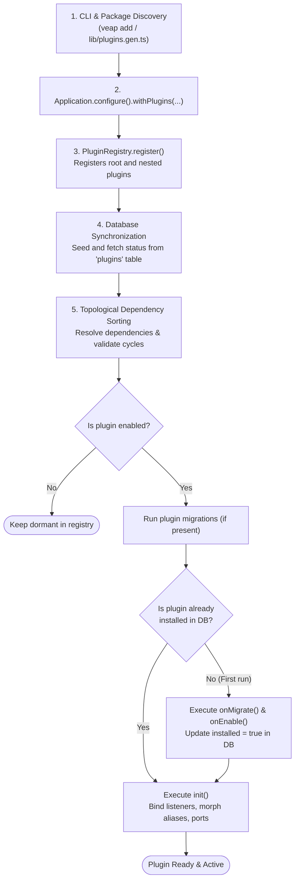

# Plugins

A plugin is a package that adds a capability to a Veap application: routes, pages, widgets, navigation, models and migrations, translations, event handlers. Plugins are isolated packages; they do not import each other's internals. They interact through the public API of `@veap/core`, the event bus, and (deliberately) each other's public exports.

## What a plugin looks like

```text
plugins/my-plugin/
├── package.json         # contains the "veap" metadata block
├── tsconfig.json
└── src/
    ├── index.ts         # default export: the IPlugin object
    ├── app/             # route tree, App Router conventions
    │   └── page.tsx
    ├── models/          # ORM models owned by this plugin
    ├── migrations/      # plugin migrations
    ├── actions/         # Server Actions
    ├── ui/              # components (widgets, dialogs)
    ├── locales/         # en.json, pl.json, ... via locale loaders
    └── navigation.ts    # navigation contribution
```

`package.json` carries the manifest inline (no separate manifest file):

```json
{
  "name": "@acme/my-plugin",
  "version": "0.1.0",
  "veap": {
    "type": "plugin",
    "id": "my-plugin",
    "name": "My Plugin",
    "description": "Does one thing well",
    "enabled": true,
    "system": false,
    "hasSetup": false,
    "dependencies": [],
    "extends": [],
    "isNpm": true
  }
}
```

The plugin's `index.ts` turns that into a `PluginManifest` and declares everything else:

```ts
import { createManifestFromPackageJson } from "@veap/core/plugins";
import type { IPlugin } from "@veap/core/plugins";
import pkg from "../package.json with { type: 'json' }";

const myPlugin: IPlugin = {
  manifest: createManifestFromPackageJson(pkg),
  locales: {
    en: () => import("./locales/en"),
    pl: () => import("./locales/pl"),
  },
  migrations: myMigrations,
  init: async () => {
    /* register listeners, morph aliases, ... */
  },
  onEnable: async () => {
    /* seed, create permissions */
  },
  onDisable: async () => {
    /* cleanup */
  },
  routeTree: async () => discoverRoutes(appDir, loader),
  navigation,
  widgets: [],
  extensions: [],
  hooks: [],
};

export default myPlugin;
```

## The IPlugin interface in full

| Property     | Type                     | Purpose                                                                     |
| ------------ | ------------------------ | --------------------------------------------------------------------------- |
| `manifest`   | `PluginManifest`         | identity, dependencies, flags                                               |
| `locales`    | `Record<locale, loader>` | message dictionaries merged into intl                                       |
| `migrations` | `Migration[]`            | run per plugin scope on install/enable                                      |
| `init`       | async fn                 | runs at every boot when the plugin is enabled                               |
| `onMigrate`  | async fn                 | hook during first install (before `onEnable`)                               |
| `onEnable`   | async fn (`context?`)    | activation hook; `context.generateSeed` is a convention some installers set |
| `onDisable`  | async fn                 | deactivation hook (after dependent plugins were disabled, before rollback)  |
| `hooks`      | `PluginHook[]`           | `{ point, handler, priority }` filter pipeline                              |
| `extensions` | `PluginExtension[]`      | React components injected into extension points                             |
| `widgets`    | `PluginWidget[]`         | dashboard widgets per area                                                  |
| `navigation` | `PluginNavigation`       | `public`, `admin`, `settings` trees                                         |
| `plugins`    | `IPlugin[]`              | nested plugins registered recursively                                       |
| `routeTree`  | `RouteNode               | fn`                                                                         | App Router-style route tree (usually `discoverRoutes`) |

## Registration and lifecycle

The following diagram illustrates how plugins are discovered, verified against the database, and initialized during application bootstrap:



1. The CLI writes plugin imports into `lib/plugins.gen.ts` (`veap add`, `veap make:plugin`, `veap register`).
2. The application builder passes the array to `.withPlugins(plugins)`.
3. `PluginServiceProvider` registers every plugin into the `PluginRegistry` (nested `plugins` too), syncs their ids into the `plugins` DB table, loads enabled/installed state from the DB, and sorts by dependencies (system plugins first; circular dependencies throw).
4. Enabled plugins are initialized in order: migrations run if present, first install triggers `onMigrate` + `onEnable`, then `init()` runs.
5. Events `system:plugins:init:start` / `system:plugins:init:end` bracket the process.

State (enabled, installed, lastStep, config JSON) persists in the `plugins` table; the manager plugin ships UI to toggle plugins, which cascades: enabling pulls in dependencies, disabling pushes disable to dependents and rolls back the plugin's migrations.

## Pages in this section

- [Creating plugins](./creating-plugins.md): CLI scaffold, file by file, registration.
- [Routing in plugins](./plugin-routing.md): route trees, the `[prefix]` magic segment, admin pages.
- [Extensions and widgets](./extensions-and-widgets.md): injecting UI into other components' areas.
- [Hooks](./hooks.md): the filter pipeline and well-known points.
- [Templates](./templates.md): themes that restyle public pages and override components.
