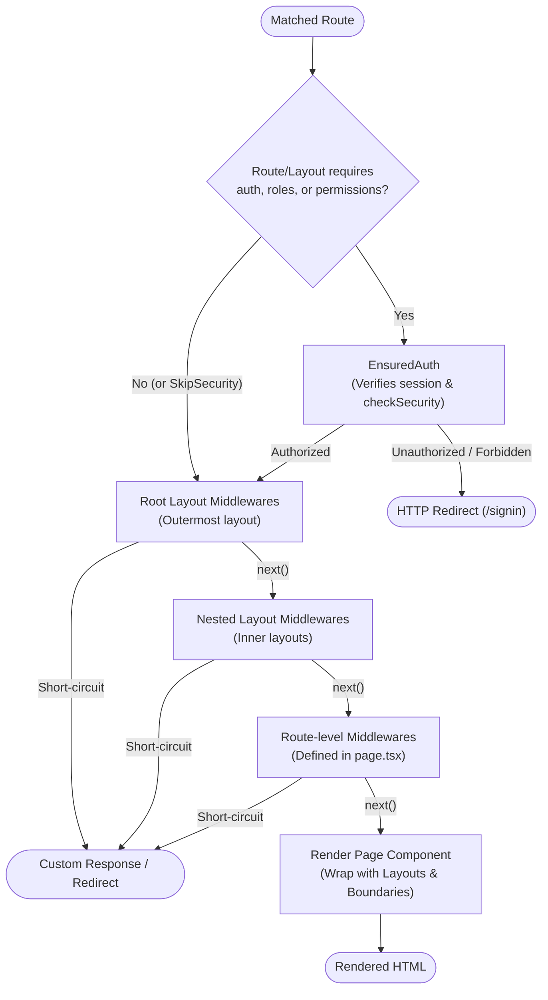

# Middleware

Veap has two middleware mechanisms, plus the Next.js proxy. Knowing which one to use avoids most confusion.

## 1. Next.js proxy (edge middleware)

The scaffold ships `proxy.ts` (Next.js 16's name for `middleware.ts`). It is standard Next.js middleware: it runs before routing and can rewrite or set headers. Veap's generated proxy adds one thing, the `x-pathname` header:

```ts
import type { NextRequest } from "next/server";
import { NextResponse } from "next/server";

export function proxy(request: NextRequest) {
  const url = new URL(request.url);
  const requestHeaders = new Headers(request.headers);
  requestHeaders.set("x-pathname", url.pathname);
  return NextResponse.next({ request: { headers: requestHeaders } });
}

export const config = {
  matcher: ["/((?!api|_next/static|_next/image|favicon.ico).*)"],
};
```

Use this layer only for cross-cutting request concerns (headers, redirects at the edge). It cannot access the database or the container.

## 2. Route middleware (virtual router)

`VeapMiddleware` runs inside the render pipeline, after route matching, before the page tree is built:

```ts
import type { VeapMiddleware } from "@veap/core/plugins";

export const requireEarlyAccess: VeapMiddleware = async (ctx, next) => {
  const { user } = await getCurrentSession();
  if (!user && !ctx.path.startsWith("/public")) {
    return redirect("/signin"); // from next/navigation
  }
  return next();
};
```

### Execution pipeline order

Middlewares are assembled in a deterministic hierarchy and executed sequentially. Any middleware can abort the chain early by returning a redirect or error boundary:



Properties:

- Signature `(context, next) => Promise<React.ReactNode>`.
- `context` is `VeapMiddlewareContext`: `{ params, searchParams, path, roles?, permissions? }`.
- Collected outermost-first along the layout chain, then route-level middlewares appended, then `EnsuredAuth` prepended when any level declares protection.
- A middleware may short-circuit by returning UI (for example a redirect, which throws) instead of calling `next()`.
- Middlewares are attached by exporting a `middlewares` array from a page/layout/route module or by putting them on a `RouteNode`.

Built-ins from `@veap/core/router`:

| Middleware     | Behavior                                                                                                 |
| -------------- | -------------------------------------------------------------------------------------------------------- |
| `EnsuredAuth`  | session required; RBAC check via `checkSecurity`; redirects to `/signin` or the security redirect target |
| `EnsuredUser`  | session required only; redirects to `/signin`                                                            |
| `EnsuredGuest` | signed-in users are redirected away (referer or `/`)                                                     |
| `SkipSecurity` | marker that suppresses the automatic `EnsuredAuth` injection for the route; pair with `EnsuredUser`      |

## 3. API middleware

For `/api/**` routes, middleware has an HTTP signature:

```ts
import type { ApiMiddleware } from "@veap/core/plugins";

export const rateLimit: ApiMiddleware = async (request, context, next) => {
  // inspect request, context.params, context.searchParams
  return next();
};
```

`ApiEnsuredAuth` (exported from `@veap/core/router/server`) is the API counterpart of `EnsuredAuth` and returns `401` JSON bodies instead of redirecting. The generated API catch-all wires it automatically when `auth`/`roles`/`permissions` are declared.

## Route protection

Protection is declarative. From any page, layout or route module:

```tsx
export const auth = true; // require a session
export const roles = ["admin"]; // user must have at least one
export const permissions = ["posts:edit"]; // user must have all
```

Collection rules: requirements from the whole layout chain and the matched node are merged (closest-to-leaf values win when the node defines its own). If anything is collected, `EnsuredAuth`/`ApiEnsuredAuth` is inserted automatically; you rarely add them by hand.

The underlying check is `checkSecurity(session, user, roles, permissions, fallbackRedirect, path)` from `@veap/core/auth/server`, which also consults registered [security requirements](../auth/extensibility.md) (for example "2FA setup required" or "email not verified"). On failure it returns `{ satisfied: false, redirect }`, and the middleware redirects (pages) or returns 401 (API). Always forward the current path (`x-pathname` from the proxy) when calling `checkSecurity` from a layout component — path-blind call sites break path-aware requirements and can cause redirect loops. See [Gate plugins](../guides/gate-plugins.md) for the complete pattern.

## Execution order summary

```text
Next.js proxy
  -> initializeSystem (layout/catch-all)
  -> route match
  -> [EnsuredAuth if needed] -> chain middlewares (outermost first) -> node middlewares
  -> build layout tree -> render page
```
