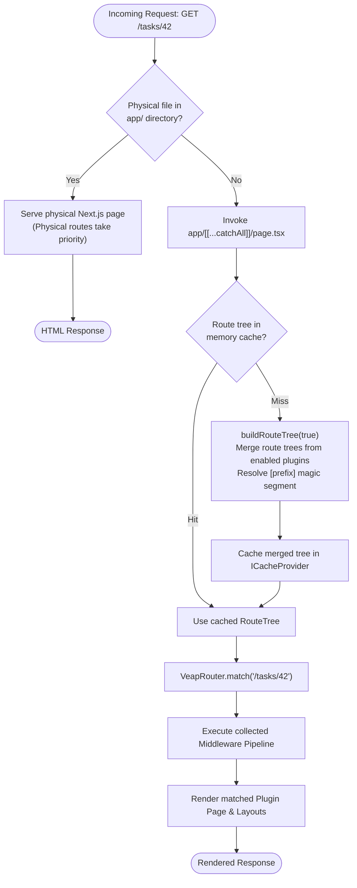

# Routing

Veap has two cooperating routing layers:

1. **Next.js routing** works normally. Any page you put in your app's `app/` directory is served by Next.js with priority.
2. **The virtual router** handles everything else. One optional catch-all page, `app/[[...catchAll]]/page.tsx`, forwards unmatched URLs to `VeapRouter`, which matches them against a tree merged from all enabled plugins.

For `API requests` the same idea applies: `app/api/[...catchAll]/route.ts` forwards `/api/*` requests to API route handlers declared by plugins.

## How URLs are resolved

The routing pipeline resolves URLs by prioritizing physical Next.js files and delegating unmatched routes to the virtual router:



`buildRouteTree(includePrivate)` merges the `routeTree` of every enabled plugin. Plugin routes whose segments start with the `[prefix]` magic segment are placed under the configured private path (`privatePath` in `veap.config.ts`, default `/app`). The merged tree is cached in the framework cache in production and invalidated when plugins toggle.

## The route tree

A `RouteNode` mirrors Next.js App Router file conventions:

| Property                       | Equivalent       | Purpose                                                                               |
| ------------------------------ | ---------------- | ------------------------------------------------------------------------------------- |
| `segment`                      | directory name   | `"blog"`, `"[id]"`, `"[...path]"`, `"[[...path]]"`, `"(marketing)"`, `"@modal"`, `""` |
| `page`                         | `page.tsx`       | the page component                                                                    |
| `layout`                       | `layout.tsx`     | wraps children                                                                        |
| `loading`                      | `loading.tsx`    | Suspense fallback                                                                     |
| `error`                        | `error.tsx`      | client error boundary                                                                 |
| `notFound`                     | `not-found.tsx`  | not-found UI                                                                          |
| `default`                      | `default.tsx`    | parallel slot fallback                                                                |
| `route`                        | `route.ts`       | API handlers `{ GET, POST, PUT, DELETE, PATCH, OPTIONS, HEAD }`                       |
| `generateMetadata`             | metadata export  | `(props) => Metadata`                                                                 |
| `middlewares`                  | route middleware | array of `VeapMiddleware` or `ApiMiddleware`                                          |
| `auth`, `roles`, `permissions` | route protection | access requirements                                                                   |
| `breadcrumb`                   | breadcrumbs      | string or function                                                                    |
| `children`                     | subdirectories   | nested segments                                                                       |
| `parallelRoutes`               | `@slot` dirs     | slot subtrees                                                                         |
| `id`                           | route id         | stable id, used by template overrides                                                 |

## Defining routes for a plugin

Plugins normally discover routes from their own `app/` directory at runtime:

```ts
// plugins/my-plugin/src/index.ts
import * as path from "node:path";
import { fileURLToPath } from "node:url";
import { discoverRoutes } from "@veap/framework/router";

const myPlugin: IPlugin = {
  manifest: createManifestFromPackageJson(pkg),
  routeTree: async () => {
    const appDir = path.join(
      path.dirname(fileURLToPath(import.meta.url)),
      "app",
    );
    return discoverRoutes(appDir, (relPath) => import(`./app/${relPath}`));
  },
};
```

`discoverRoutes(dir, dynamicImport)` scans the directory recursively and maps file conventions exactly like App Router: `page.tsx`, `layout.tsx`, `loading.tsx`, `error.tsx`, `not-found.tsx`, `default.tsx`, `route.ts`. Page/layout/route modules may also export `auth`, `roles`, `permissions`, `middlewares` and `generateMetadata`, which are picked up automatically. Directories starting with `.` or `_` are ignored; `node_modules` is skipped.

You can also build trees in code with the `RouteTree` class:

```ts
import { RouteTree } from "@veap/framework/router";

const tree = new RouteTree();
tree.addTree({
  segment: "",
  layout: RootLayout,
  children: [
    {
      segment: "blog",
      page: BlogPage,
      children: [{ segment: "[slug]", page: BlogPostPage }],
    },
  ],
});

const result = tree.match("/blog/hello-world");
// result.params => { slug: "hello-world" }
```

## Matching rules

Segment priority follows App Router: static, then route groups (transparent), then dynamic `[param]`, then catch-all `[...param]` (1+ segments), then optional catch-all `[[...param]]` (0+ segments). Matching produces:

```ts
interface MatchResult {
  node: RouteNode; // matched leaf
  params: Record<string, string>; // dynamic params, catch-all joined with "/"
  layoutChain: LayoutChainEntry[]; // root -> leaf, with layouts/boundaries/protection
  matchedSegments: string[];
  isExact: boolean; // false for partial matches (404 rendering)
}
```

Route groups organize the tree without affecting URLs; their layouts and protection still apply. Parallel slots (`@slot`) are matched independently against the remaining path for each layout level and fall back to the slot's `default` component.

## Pages receive

```tsx
export default async function Page({
  params,
  searchParams,
  config,
  breadcrumbs,
  context,
}) {
  // params: matched params (already resolved, not a Promise)
  // searchParams: query parameters
  // config: active template config (if any)
  // breadcrumbs: resolved BreadcrumbItem[] for this path
  // context: VeapMiddlewareContext after the middleware pipeline
}
```

## Virtual vs physical pages

Physical Next.js pages can participate in the virtual router (inherit plugin layouts, middleware protection, parallel slots) with the `withRouter` HOC; see [Physical pages and withRouter](./physical-pages.md).

## Limitations

- Route matching happens per request against merged plugin trees; URLs not matched by any plugin hit the 404 path of the router (nearest `notFound`).
- `isExact === false` partial matches render the not-found UI; they do not rewrite the URL.
- The route tree cache stores component references in memory; it is per server process, like the rest of the framework state.
